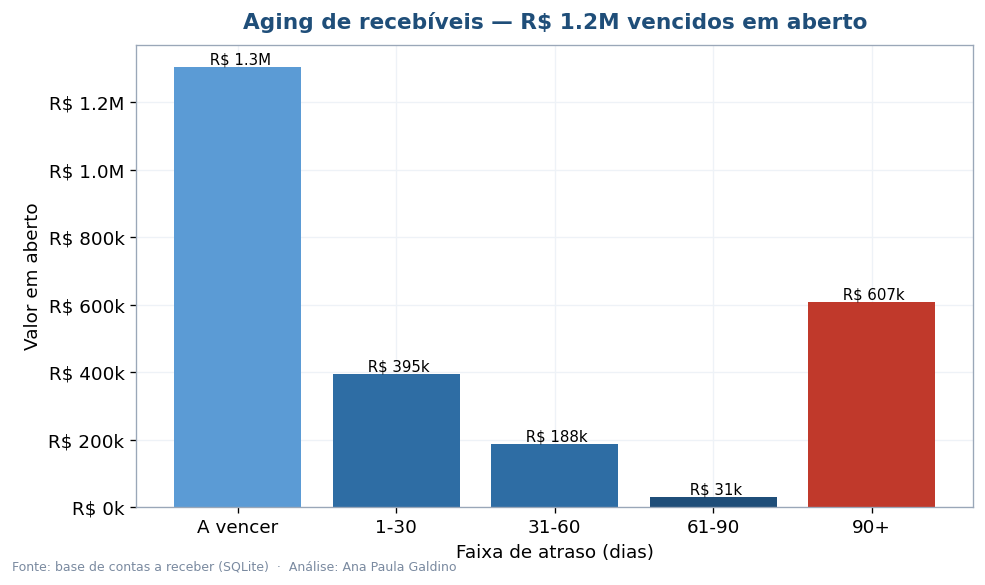
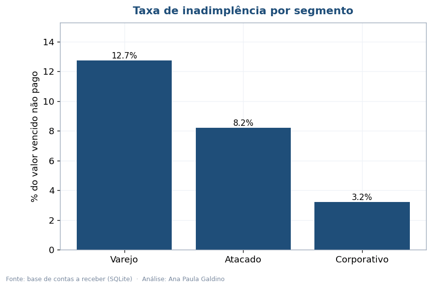
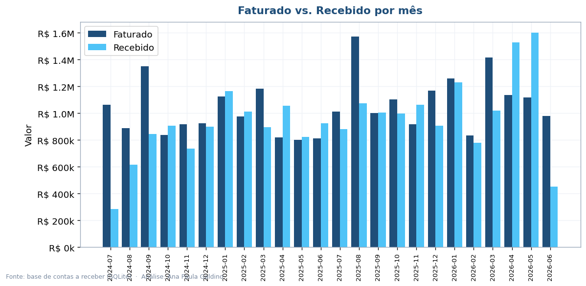
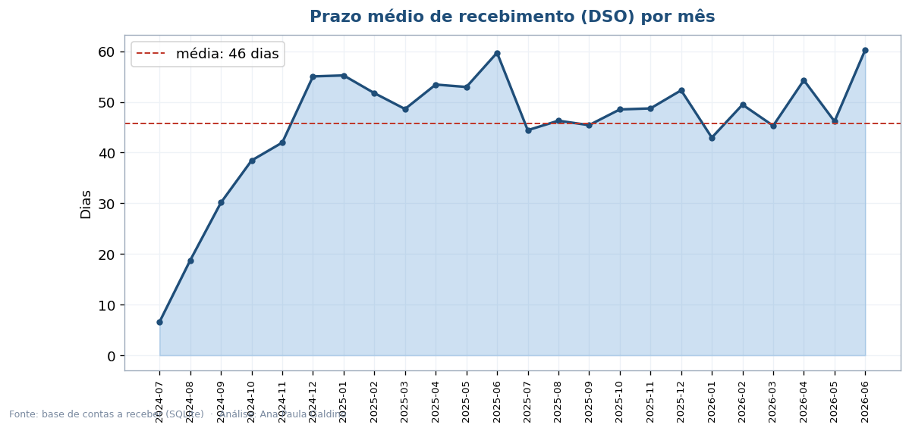
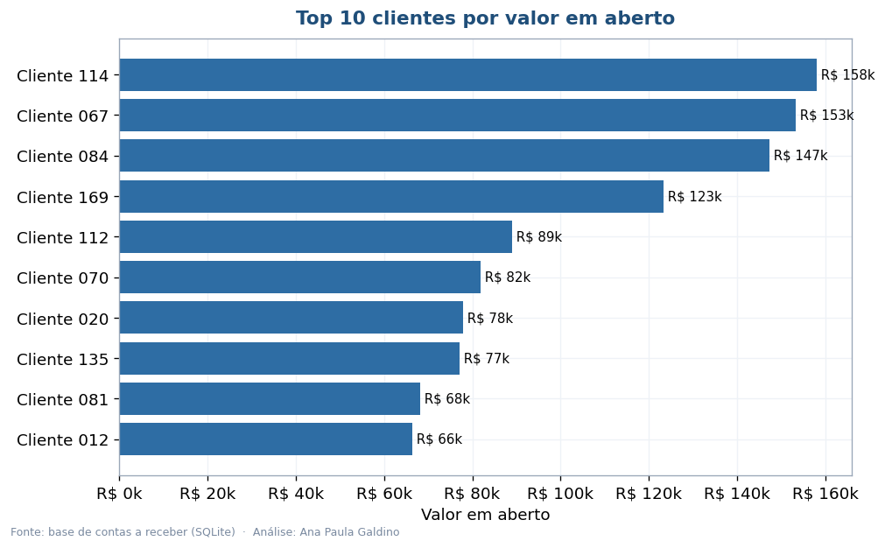
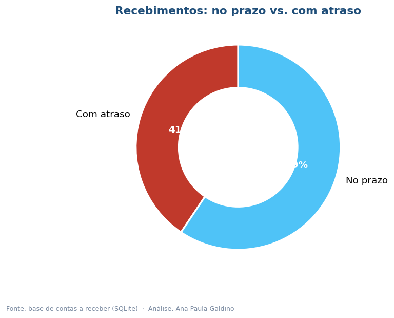

# Faturamento e Inadimplência — Análise de Contas a Receber (SQL + Python)

Trabalho com faturamento no dia a dia, então montei este projeto para mostrar como olho
para uma carteira de recebíveis: do banco de dados às decisões de cobrança. Parti de uma
base SQL (SQLite), escrevi as consultas de negócio e transformei os resultados em 6
visualizações e um relatório executivo.

**[Ler o relatório executivo (PDF)](Analise_Executiva_Faturamento.pdf)**

## As perguntas de negócio

- Quanto temos a receber e quanto já está vencido?
- Em quanto tempo, na média, o dinheiro entra (DSO)?
- Onde está a inadimplência — em quais clientes e segmentos?
- Estamos recebendo no prazo?

## O que a base mostrou

| Indicador | Resultado |
|---|---|
| Total em aberto | R$ 2,5 milhões |
| Já vencido | R$ 1,2 milhão |
| Prazo médio de recebimento (DSO) | ~46 dias |
| Inadimplência geral | 5,1% do valor vencido |
| Segmento mais inadimplente | Varejo (12,7%) |
| Recebido dentro do prazo | 59% |

## As consultas SQL

As análises saem de consultas escritas à mão em [`src/consultas.sql`](src/consultas.sql) —
aging com `CASE WHEN` sobre `julianday`, inadimplência por segmento com `JOIN` e agregação,
top devedores, faturado vs. recebido por mês e cálculo do prazo médio de recebimento.

## As visualizações

| | |
|---|---|
|  |  |
|  |  |
|  |  |

## Tecnologias

SQL (SQLite), Python 3.10+, pandas, matplotlib e reportlab.

## Organização

```
faturamento-inadimplencia-sql/
├── README.md
├── Analise_Executiva_Faturamento.pdf
├── requirements.txt
├── dados/faturamento.db          # banco SQLite com clientes, faturas e pagamentos
├── src/
│   ├── gerar_base.py             # cria o banco e popula com dados realistas
│   ├── consultas.sql             # as consultas de negócio
│   ├── analise_faturamento.py    # roda as queries e gera os 6 gráficos
│   └── gerar_relatorio.py        # monta o PDF
└── imagens/
```

```bash
pip install -r requirements.txt
python src/gerar_base.py            # (re)cria o banco
python src/analise_faturamento.py   # gráficos
python src/gerar_relatorio.py       # relatório PDF
```

## Sobre os dados

O banco (180 clientes, 2.300 faturas) é gerado por mim para reproduzir um cenário realista
de contas a receber, com padrões de atraso e inadimplência por segmento. Assim o projeto roda
do zero sem depender de dados sensíveis. É só trocar a base pela real mantendo o mesmo schema.

---

Ana Paula Galdino · Supervisão de Faturamento · Data Analytics (POSTECH/FIAP)
[GitHub](https://github.com/AnaPaula-Galdino) · [LinkedIn](https://linkedin.com/in/galdinoana/)
